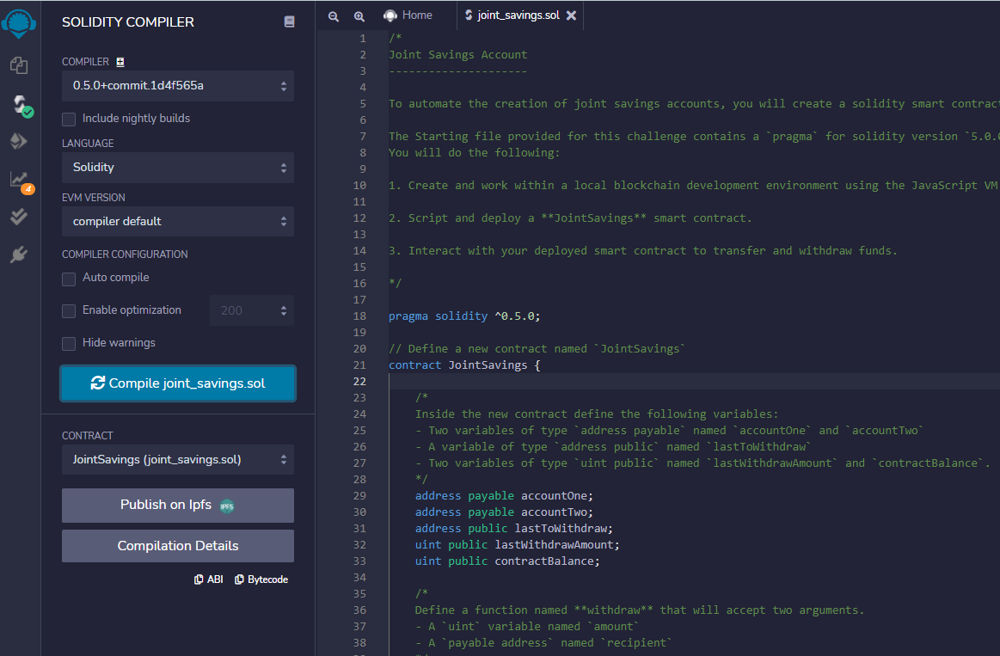
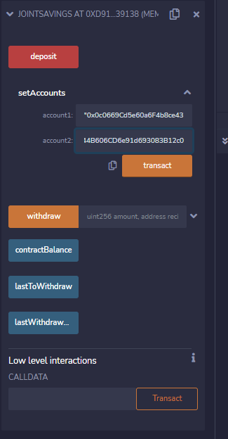
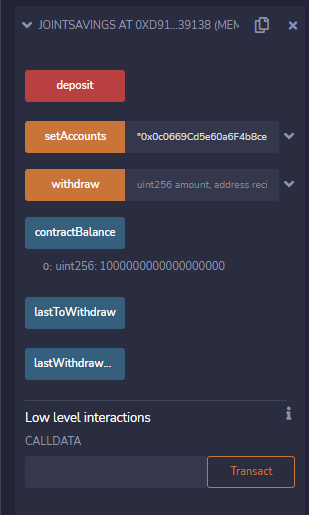
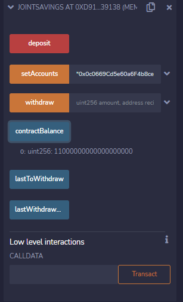
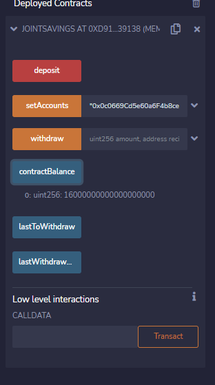
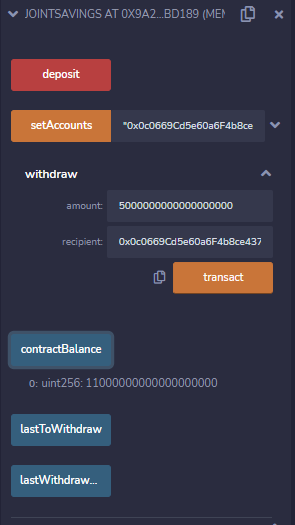
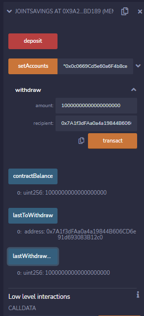

# joint_savings
# FinTech Challenge 18

## Screenshot of code compiling successfully

## Screenshot of setAccounts function

## Screenshots of deposit function working
### Depositing 1 ETH

### Depositing 10 ETH

### Depositing 5 ETH

## Screenshots withdrawing function working 
(lastToWithdraw and lastWithdrawAmount functions included in screenshots to verify address and amount were correct)
### Transferring 5 ETH

### Transferring 10 ETH
